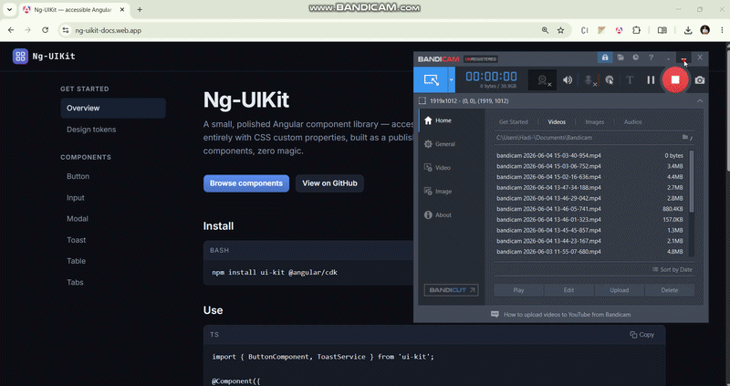

# Ng-UIKit — accessible Angular component library

[](https://github.com/Hadi-AlKammouni/ng-uikit/actions/workflows/ci.yml)
[](LICENSE)

> A small, polished Angular component library with a live documentation site — six components, design tokens, accessibility-first. Built as a publishable Angular library + a hand-built docs app to show the architecture end-to-end.



**Live docs:** **<https://ng-uikit-docs.web.app>**

---

## What this demonstrates

- **Reusable Angular library architecture** — `ng-packagr`-built publishable library (`projects/ui-kit/`) consumed by a sibling docs app (`projects/docs/`) in the same workspace.
- **Strict TypeScript** — `tsconfig.json` ships with `strict: true`, `noImplicitOverride`, `noPropertyAccessFromIndexSignature`, and `noImplicitReturns` all on.
- **Standalone components only** — no `NgModule`s. Every symbol is tree-shakeable.
- **Design tokens via CSS custom properties** — every visual decision (color, spacing, type, radii, motion) is a `--var`. A theme switch is a one-attribute toggle, no rebuild, no JS.
- **Accessibility as a feature** — focus traps, ARIA live regions, roving tabindex, `aria-sort`, `aria-busy`. Every docs page has an "Accessibility" callout describing what's enforced.
- **Angular CDK** — `Overlay` + `Portal` + `ConfigurableFocusTrap` power Modal and Toast.
- **Test automation** — Playwright E2E running against the docs site exercises every component through real DOM interactions.

---

## Components

| | Component | What it shows |
|---|---|---|
| 1 | **Button** | Attribute selector on native `<button>`/`<a>`, 4 variants × 3 sizes, loading state with `aria-busy`. |
| 2 | **Input + Form field** | Reactive-forms-ready directive + a wrapper for label/hint/error with `aria-describedby` + `role="alert"`. |
| 3 | **Modal** | CDK Overlay + Portal, focus trap, ESC + backdrop dismiss, focus restoration on close. |
| 4 | **Toast** | Service-driven stack, top-right overlay, ARIA live politeness scales with severity. |
| 5 | **Data Table** | Sortable columns with `aria-sort`, local pagination, empty + loading states. |
| 6 | **Tabs** | Roving tabindex, arrow-key + Home/End nav, disabled tabs skipped. |

---

## Repo layout

```
projects/
  ui-kit/        ← the publishable Angular library
    src/lib/
      button/         button.component
      input/          input.directive + form-field.component
      modal/          service + container + CDK overlay glue
      toast/          service + viewport
      table/          generic, sortable, paginated
      tabs/           tabs + tab content children
      styles/         _tokens.scss, theme.scss (one import = themed)
  docs/          ← the live documentation app
    src/app/
      shell/          topbar + sidebar
      docs/           reusable code-block, props-table, example-block
      pages/          one route per component + Home + Tokens
e2e/             ← Playwright tests against the docs app
```

---

## Run it locally

```bash
git clone https://github.com/Hadi-AlKammouni/ng-uikit.git
cd ng-uikit
npm install
npm start              # docs app at http://localhost:4200
```

```bash
# Build the publishable library
npm run build:lib      # output: dist/ui-kit

# Build the docs site
npm run build:docs     # output: dist/docs/browser
```

```bash
# Run the Playwright suite (six tests)
npm run e2e:install    # one-time: install Playwright browsers
npm test
```

---

## Use it in your own app

```bash
npm install ui-kit @angular/cdk @angular/animations
```

```ts
import { Component, inject } from '@angular/core';
import { ButtonComponent, ToastService } from 'ui-kit';

@Component({
  imports: [ButtonComponent],
  template: `<button uikitButton (click)="save()">Save</button>`,
})
export class MyForm {
  private readonly toasts = inject(ToastService);
  save() { this.toasts.success('Saved.'); }
}
```

In your global stylesheet, import the theme once:

```scss
@use 'ui-kit/styles/theme';            // tokens + base reset
@use 'ui-kit/styles/modal-overlay';    // CDK overlay backdrop/panel classes
```

---

## Design decisions

- **CSS custom properties for theming.** Each token (`--accent`, `--surface`, `--space-4`, etc.) is a CSS variable, not a Sass build-time constant. That means dark/light is a single attribute on `<html>`, custom brand themes are a stylesheet override, and the library never has to be re-published to change colors.
- **Attribute-selector for `Button`.** `<button uikitButton>` keeps native semantics. The component is just a class + styles + host bindings — no wrapping `<div>`, no `(click)` proxy, no focus-management surprises.
- **CDK over hand-rolled overlays.** Modal and Toast use `@angular/cdk/overlay` because the hard parts (scroll lock, focus management, stacking order) are already correct. The custom layer is just visual.
- **Standalone components.** Consumers import individual symbols; the bundle pays only for what's used.
- **Source-mapped path alias.** `tsconfig.json` maps `ui-kit` → `projects/ui-kit/src/public-api.ts` so the docs app re-renders on every library change with no build step.

---

## Tech stack

- **Angular 21** (standalone, signals, zoneless change detection, `@angular/build` + `ng-packagr`)
- **Angular CDK** (Overlay, Portal, A11y)
- **TypeScript** with strict mode
- **SCSS** + CSS custom properties
- **Playwright** for E2E
- **GitHub Actions** for CI
- **Firebase Hosting** for the live docs

---

## License

MIT © Hadi Al Kammouni
